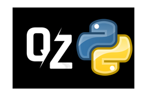
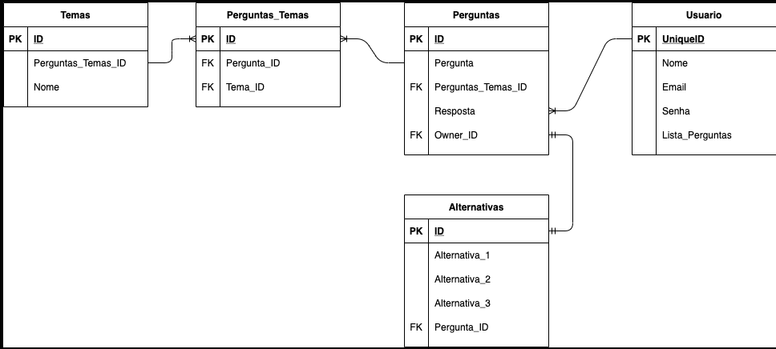

API de Quiz, com perfil de usuário, podendo postar QUIZES com perguntas de temas setados, responder e gerar uma pontuação em seu perfil. Terá um ranking de maior pontuação.

# Desenvolvedores

- Luiz Almeida - Quality Assurance
- Eduardo Vargas - Scrumm Master
- Pedro Henrique - Tech Leader
- Luan Lopes - Dev Booster
- Yuri Baldini - Product Owner

# Tecnologias

Flask, Psycopg2, JWT, SQLAlchemy, Environs, Faker, Migrate, GoogleSearch.

# Features

O Projeto inicialmente foi dividido em 5 features, sendo elas:

Usuário, para cadastro, acesso, deleção e atualização.

Perguntas, onde as perguntas serão armazenadas com IDs únicos e atreladas ao usuário que a criou.

Alternativas, que serão atreladas a lista de perguntas, usando uma FK da pergunta.

Temas, as perguntas serão divididas por temas e o mesmo fara essa ponte também através de FKs para cada pergunta relacionada a cada tema.

Perguntas_Temas, uma tabela intermediária que fara a ligação das tabelas perguta e tema.

# Rotas

ROOT usuários - "/usuario".

"/register" ["POST"] - Para cadastro de novos usuários.

"nome": "yourname",

"email": "yoruemail@domain.com",

"senha": "yourpassword"

"/login" ["POST"] - Para logar o usuário.

"email": "yoruemail@domain.com",

"senha": "yourpassword"

"/<int:<usuario_id>" ["GET"] - Para buscar as perguntas especificas de um usuário.

"/" ["DELETE"] - Deleção de usuários via Token.

"/" ["PATCH, PUT"] - Para atualização de usuários, autorização via Token.

ROOT temas - "/tema"

"/<string:tema>" ["GET"] - Retorna perguntas do tema escolhido.

"/" ["POST"] - Para criação de novas perguntas. Token requerido.

"/<int:tema_id> " ["PATCH, PUT"] - Para atualizar ou modificar as perguntas. Token Requerido.

"tema": "tema"_update"

"/<int:tema_id>" ["DELETE"] - Para deletar as perguntas via id. Token requerido.

ROOT perguntas - "/pergunta"

"/" ["GET"] - Retorna todas as perguntas.

"/aleatoria?tema=tema" ["GET"] - Retorna pergunta aleatória do tema.

"/<int:pergunta_id>" ["GET"] - Retorna perguntas específicas pelo id.

"/" ["POST"] - Para criação de novas perguntas. Token requerido.

"pergunta": "question",

"resposta": "answer",

"tema": "theme",

"alternativa1": "alternative1",

"alternativa2": "alternative2",

"alternativa3": "alternative3"

"/<int:pergunta_id>" ["DELETE"] - Para deleção de perguntas pelo id. Token requerido.

"/<int:pergunta_id>" ["PATCH, PUT"] - Para modificação da pergunta pelo id. Token requerido.

# Divisão de tarefas:

Criação de rotas e acesso ao BD dos Usuários: Yuri Baldini e Eduardo Vargas

Criação de rotas e acesso ao BD das Perguntas: Luiz Almeida e Pedro Henrique

Criação de rotas e acesso ao BD dos Temas: Luan Lopes e Luiz Almeida

Popular o banco de dados: Todos.

# Esquema do Banco de Dados

# Trello

[https://trello.com/b/PSLKwU1e/capstoneq3](https://trello.com/b/PSLKwU1e/capstoneq3)